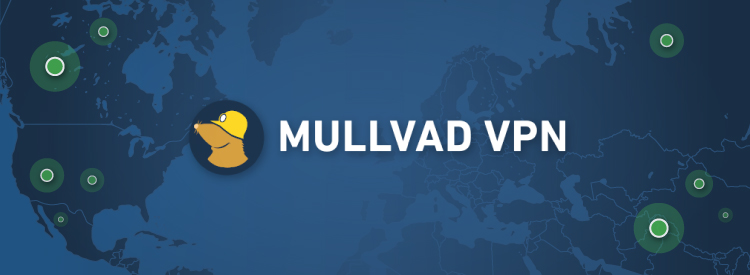

# MullvadPy

MullvadPY is a python package used to connect/reconnect/disconnect using the mullvad VPN CLI Interface. The interface comes pre-installed with the download of the gui interface of the VPN client. Easy to implement in your code with simple syntax.

## Features
• Updated Relay List
• Randomized Location list (US Based)